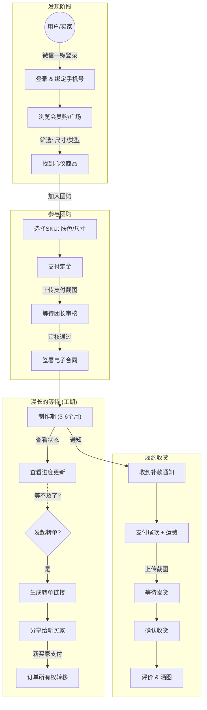
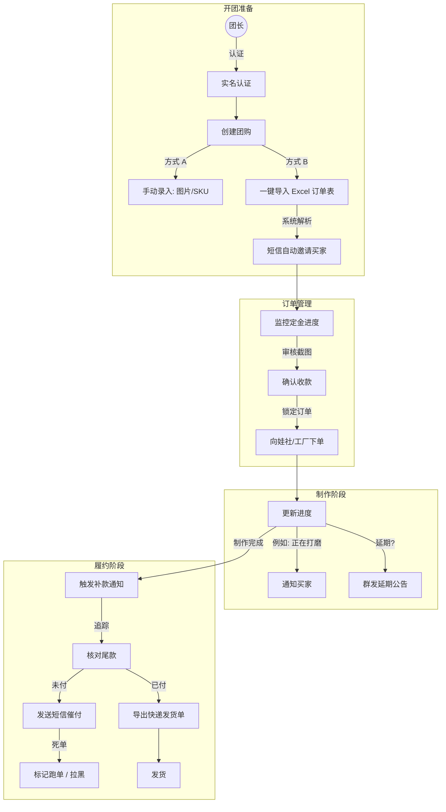
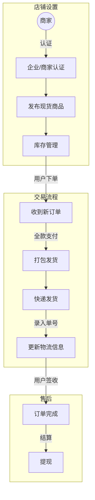
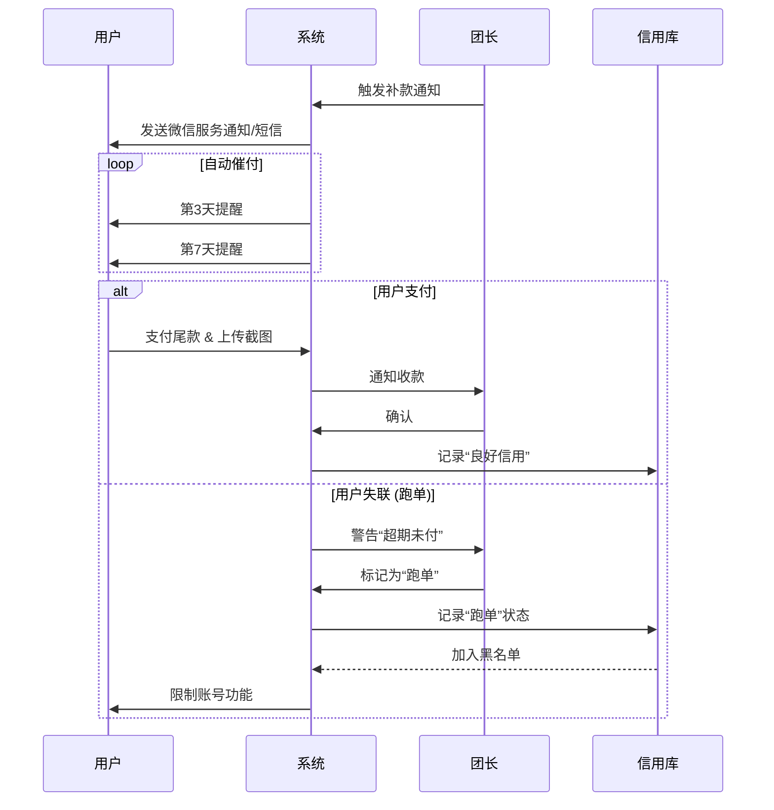
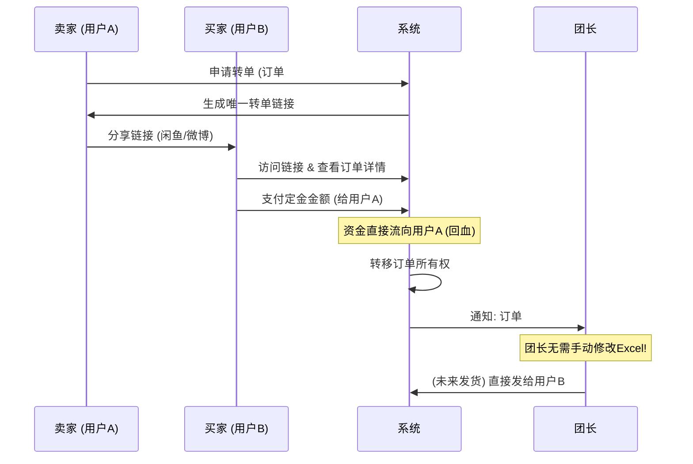

# BJD App 业务逻辑全景图

本文档通过 Mermaid 图表详细展示了 BJD 应用程序的完整业务逻辑，涵盖了**用户（买家）**、**团长（组织者）**和**商家（卖家）**三个核心角色的全生命周期。

## 1. 用户 (买家) 生命周期
从发现商品到收货的全过程，包含特色的“转单”功能。

## 2. 团长 (组织者) 生命周期
管理复杂的团购流程，从 Excel 导入到发货。

## 3. 商家 (卖家) 生命周期
现货商品的简化销售流程。

## 4. 核心交互闭环

### “防跑单”机制
系统如何保护团长，防止用户弃单。

### “转单”机制 (Killer Feature)
用户如何安全地转让名额，无需打扰团长。

