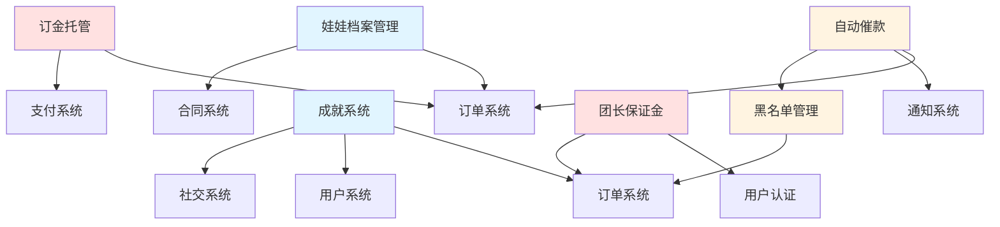
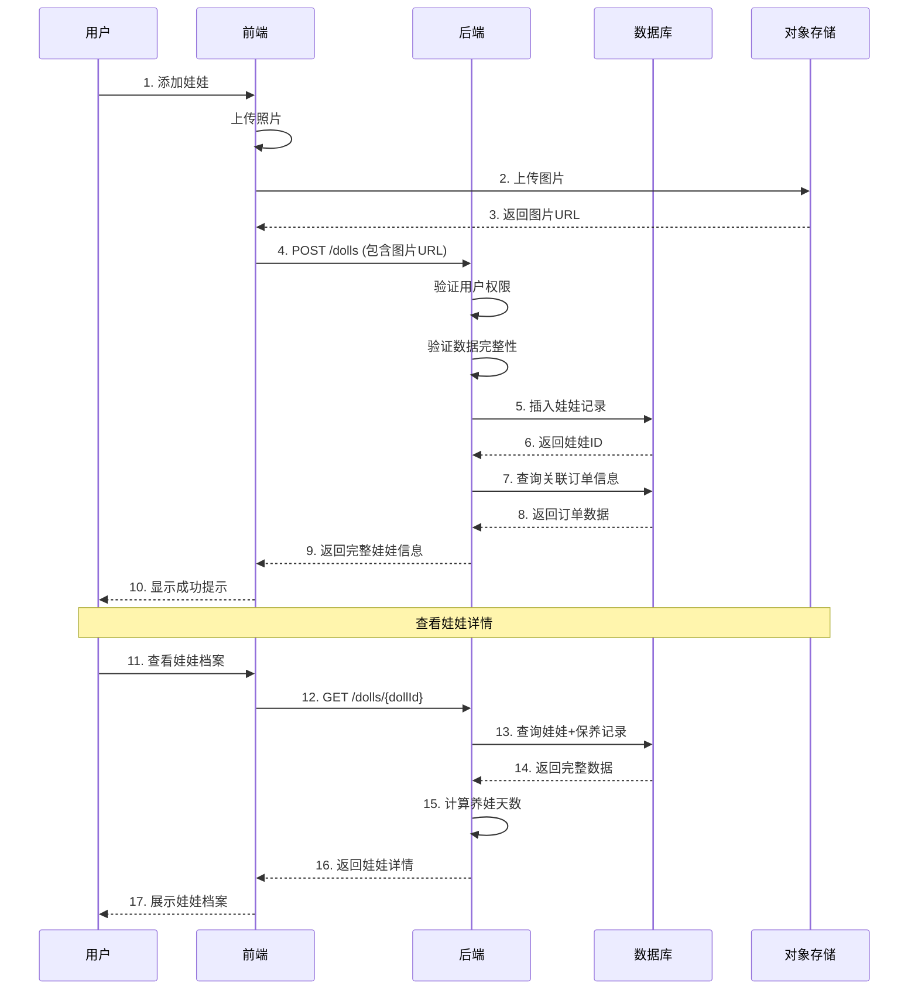
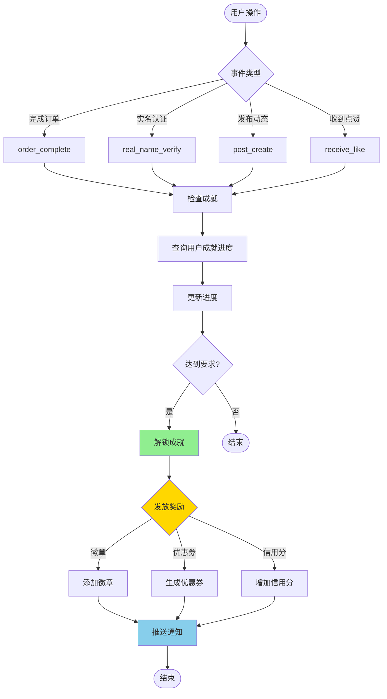
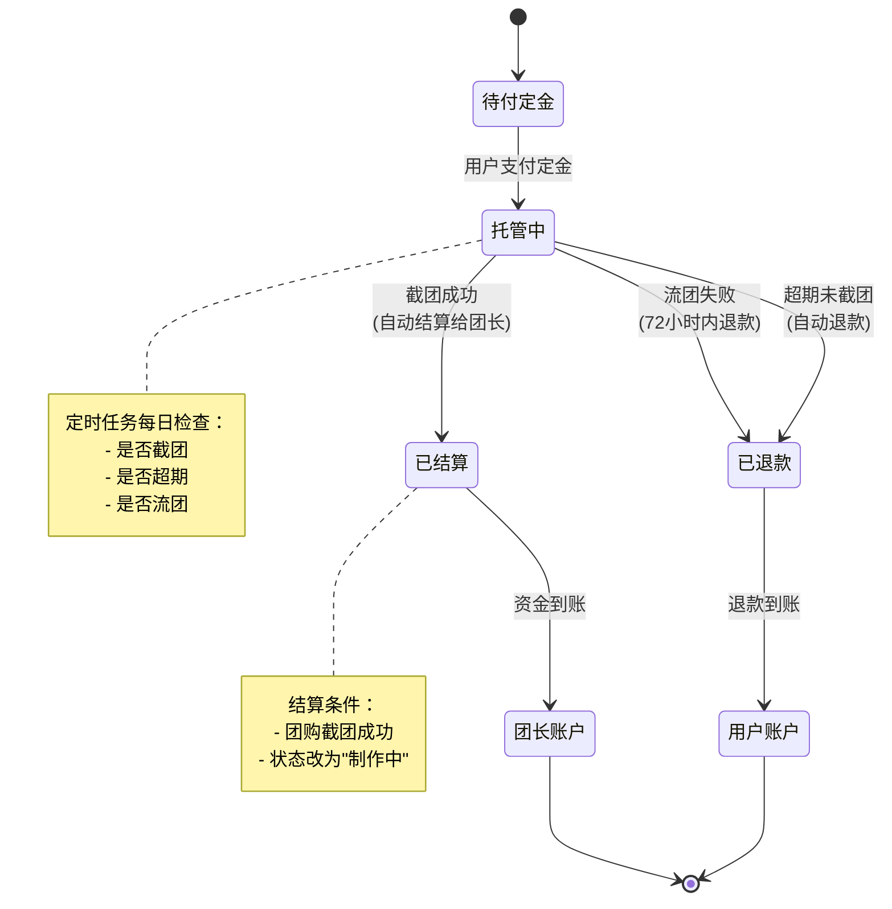
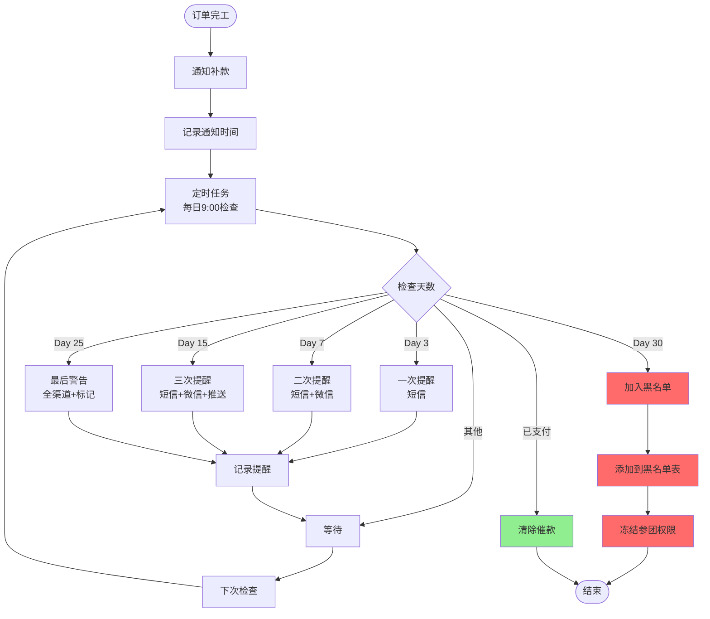
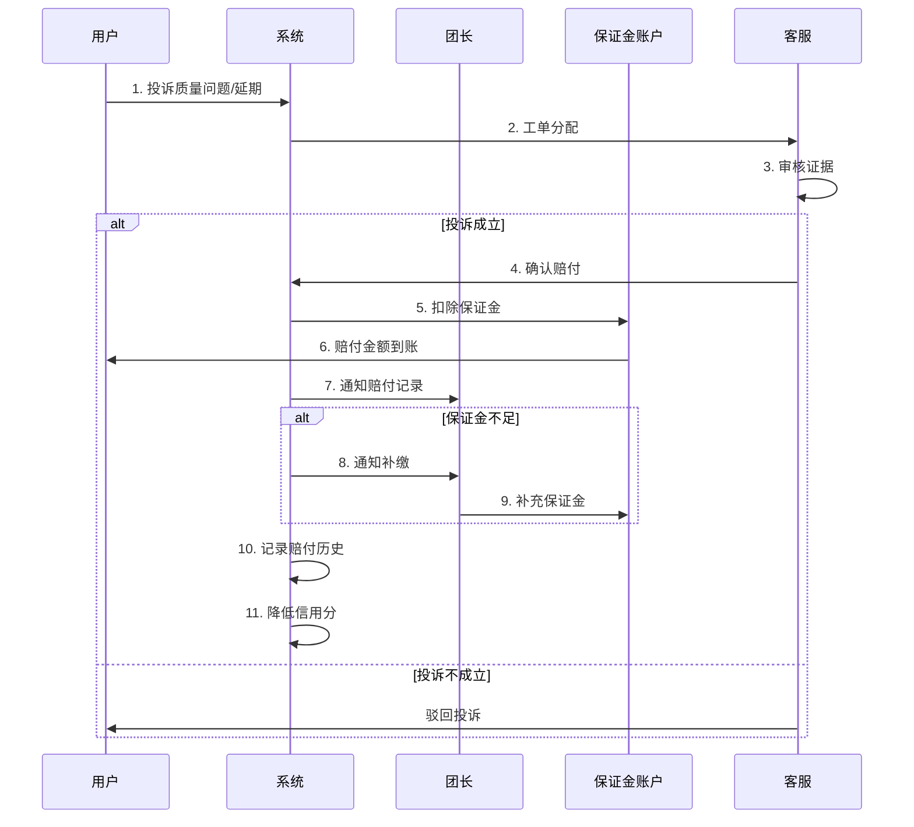
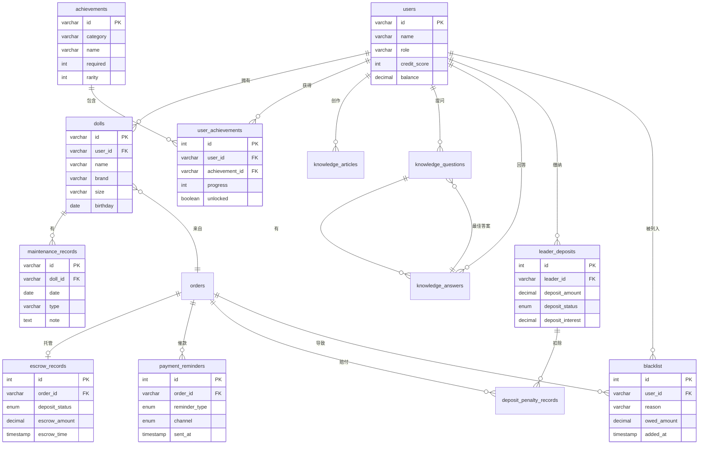

# BJD团购平台 - 后端开发指南（P0核心功能）

## 📋 文档信息
- **项目名称**：GOMaster / 拼团大师
- **版本号**：v1.1.0
- **创建日期**：2024-12-08
- **文档类型**：后端开发指南
- **优先级**：P0（核心功能，优先实现）
- **技术栈**：Rust + Axum + PostgreSQL + sqlx

---

## 📑 目录

- [一、P0功能概览](#一p0功能概览)
- [二、API接口清单](#二api接口清单)
- [三、业务流程图](#三业务流程图)
- [四、数据库表结构](#四数据库表结构)
- [五、核心业务逻辑](#五核心业务逻辑)
- [六、技术要点](#六技术要点)
- [七、开发计划](#七开发计划)

---

## 一、P0功能概览

### 1.1 功能列表

| 功能模块 | 优先级 | 前端状态 | 后端状态 | 接口数量 | 数据表数量 |
|---------|--------|---------|---------|---------|-----------|
| 娃娃档案管理 | **P0** | ✅ 完成 | ⏳ 待开发 | 7个 | 2个 |
| 成就系统 | **P0** | ✅ 完成 | ⏳ 待开发 | 3个 | 2个 |
| BJD知识库 | **P0** | ✅ 完成 | ⏳ 待开发 | 5个 | 3个 |
| 订金托管 | **P0** | ⏳ 待开发 | ⏳ 待开发 | 3个 | 1个 |
| 团长保证金 | **P0** | ⏳ 待开发 | ⏳ 待开发 | 3个 | 2个 |
| 自动催款 | **P0** | ⏳ 待开发 | ⏳ 待开发 | 2个 | 1个 |
| 黑名单管理 | **P0** | ⏳ 待开发 | ⏳ 待开发 | 3个 | 1个 |

**总计**：**26个API接口**，**12个数据表**

---

### 1.2 依赖关系



---

## 二、API接口清单

### 2.1 娃娃档案管理（7个接口）⭐

#### 接口列表

| 方法 | 路径 | 说明 | 权限 |
|------|------|------|------|
| GET | `/api/v1/dolls` | 获取娃娃列表 | 登录用户 |
| GET | `/api/v1/dolls/{dollId}` | 获取娃娃详情 | 娃娃所有者 |
| POST | `/api/v1/dolls` | 添加娃娃 | 登录用户 |
| PUT | `/api/v1/dolls/{dollId}` | 更新娃娃信息 | 娃娃所有者 |
| DELETE | `/api/v1/dolls/{dollId}` | 删除娃娃 | 娃娃所有者 |
| POST | `/api/v1/dolls/{dollId}/maintenance` | 添加保养记录 | 娃娃所有者 |
| POST | `/api/v1/dolls/{dollId}/id-card` | 生成电子身份证 | 娃娃所有者 |

#### 业务规则
- ✅ 用户只能查看/修改自己的娃娃
- ✅ 删除娃娃时级联删除保养记录
- ✅ 养娃天数 = 当前日期 - birthday
- ✅ 支持从订单导入娃娃信息

---

### 2.2 成就系统（3个接口）⭐

#### 接口列表

| 方法 | 路径 | 说明 | 权限 |
|------|------|------|------|
| GET | `/api/v1/achievements` | 获取成就列表 | 登录用户 |
| POST | `/api/v1/achievements/check` | 检查成就解锁 | 系统内部 |
| POST | `/api/v1/achievements/{achievementId}/claim` | 领取成就奖励 | 登录用户 |

#### 业务规则
- ✅ 成就自动解锁（事件触发）
- ✅ 奖励包括：虚拟徽章 + 优惠券 + 信用分
- ✅ 成就稀有度：1-普通、2-稀有、3-史诗
- ✅ 已解锁成就可分享

---

### 2.3 BJD知识库（5个接口）⭐

#### 接口列表

| 方法 | 路径 | 说明 | 权限 |
|------|------|------|------|
| GET | `/api/v1/knowledge/articles` | 获取文章列表 | 公开 |
| GET | `/api/v1/knowledge/articles/{articleId}` | 获取文章详情 | 公开 |
| GET | `/api/v1/knowledge/questions` | 获取热门问答 | 公开 |
| GET | `/api/v1/knowledge/search` | 搜索知识库 | 公开 |
| POST | `/api/v1/knowledge/{type}/{id}/like` | 点赞文章/回答 | 登录用户 |

#### 业务规则
- ✅ 支持全文搜索（MySQL FULLTEXT）
- ✅ 阅读数自动+1（访问详情页时）
- ✅ 文章支持Markdown格式
- ✅ 视频类型文章需要视频URL

---

### 2.4 订金托管（3个接口）⭐

#### 接口列表

| 方法 | 路径 | 说明 | 权限 |
|------|------|------|------|
| POST | `/api/v1/orders/{orderId}/deposit-escrow` | 支付订金（托管） | 订单所有者 |
| GET | `/api/v1/orders/{orderId}/escrow-status` | 查询托管状态 | 订单相关方 |
| POST | `/api/v1/orders/{orderId}/refund` | 申请退款 | 订单所有者 |

#### 业务规则
- ✅ 订金先托管在平台，不直接给团长
- ✅ 截团成功 → 自动结算给团长
- ✅ 流团失败 → 72小时内自动退款
- ✅ 超期未截团 → 自动退款

---

### 2.5 团长保证金（3个接口）⭐

#### 接口列表

| 方法 | 路径 | 说明 | 权限 |
|------|------|------|------|
| GET | `/api/v1/deposits/leader/{leaderId}` | 获取保证金信息 | 团长本人 |
| POST | `/api/v1/deposits/pay` | 缴纳保证金 | 团长 |
| POST | `/api/v1/deposits/withdraw-interest` | 提取利息 | 团长本人 |

#### 业务规则
- ✅ 首次开团需缴纳5000元保证金
- ✅ 信用分≥90可降至3000元
- ✅ 保证金年化3%生息
- ✅ 用于赔付跑单、质量问题

---

### 2.6 自动催款（2个接口）⭐

#### 接口列表

| 方法 | 路径 | 说明 | 权限 |
|------|------|------|------|
| GET | `/api/v1/orders/{orderId}/reminders` | 获取催款记录 | 团长/订单所有者 |
| POST | `/api/v1/orders/{orderId}/send-reminder` | 手动触发催款 | 团长 |

#### 业务规则
- ✅ 自动催款：第3/7/15/25天
- ✅ 多渠道：短信 + 微信 + App推送
- ✅ 超30天自动加入黑名单
- ✅ 补款后自动解除预警

---

### 2.7 黑名单管理（3个接口）⭐

#### 接口列表

| 方法 | 路径 | 说明 | 权限 |
|------|------|------|------|
| GET | `/api/v1/blacklist` | 查询黑名单 | 团长 |
| POST | `/api/v1/blacklist` | 添加到黑名单 | 系统/团长 |
| DELETE | `/api/v1/blacklist/{userId}` | 解除黑名单 | 系统 |

#### 业务规则
- ✅ 跑单用户全平台共享
- ✅ 黑名单用户无法参团
- ✅ 补齐欠款自动解除
- ✅ 团长可查看但不能私自删除

---

## 三、业务流程图

### 3.1 娃娃档案管理流程



---

### 3.2 成就系统触发流程



---

### 3.3 订金托管业务流程



---

### 3.4 自动催款流程



---

### 3.5 团长保证金赔付流程



---

## 四、数据库表结构

> **注意**：以下所有SQL语句使用 **PostgreSQL 14+** 语法。
> 
> 与MySQL的主要差异：
> - `AUTO_INCREMENT` → `SERIAL` 或 `GENERATED ALWAYS AS IDENTITY`
> - `ENUM` → `CREATE TYPE` 或使用 `VARCHAR` + `CHECK` 约束
> - `COMMENT` 语法改为 `COMMENT ON` 语句
> - `ON UPDATE CURRENT_TIMESTAMP` 需要使用触发器实现
> - `ENGINE=InnoDB` 和 `CHARSET` 不需要

### 4.1 娃娃档案相关（2张表）

#### dolls - 娃娃档案表

```sql
-- PostgreSQL语法
CREATE TABLE dolls (
  id VARCHAR(50) PRIMARY KEY,
  user_id VARCHAR(50) NOT NULL,
  name VARCHAR(100) NOT NULL,
  brand VARCHAR(100),
  size VARCHAR(20),
  skin_color VARCHAR(50),
  birthday DATE,
  weight INTEGER,
  height INTEGER,
  eye_color VARCHAR(50),
  wig_color VARCHAR(50),
  makeup VARCHAR(100),
  main_image VARCHAR(255),
  images JSONB,
  order_id VARCHAR(50),
  contract_id VARCHAR(50),
  outfit_count INTEGER DEFAULT 0,
  photo_count INTEGER DEFAULT 0,
  notes TEXT,
  create_time TIMESTAMP DEFAULT CURRENT_TIMESTAMP,
  update_time TIMESTAMP DEFAULT CURRENT_TIMESTAMP,
  
  FOREIGN KEY (user_id) REFERENCES users(id),
  FOREIGN KEY (order_id) REFERENCES orders(id)
);

-- 创建索引
CREATE INDEX idx_dolls_user ON dolls(user_id);
CREATE INDEX idx_dolls_birthday ON dolls(birthday);
CREATE INDEX idx_dolls_create_time ON dolls(create_time);

-- 添加注释
COMMENT ON TABLE dolls IS '娃娃档案表';
COMMENT ON COLUMN dolls.id IS '娃娃ID';
COMMENT ON COLUMN dolls.user_id IS '用户ID';
COMMENT ON COLUMN dolls.name IS '娃娃名称';
COMMENT ON COLUMN dolls.birthday IS '生日';
COMMENT ON COLUMN dolls.images IS '照片集合(JSON数组)';

-- 创建触发器实现自动更新update_time
CREATE OR REPLACE FUNCTION update_dolls_updated_at()
RETURNS TRIGGER AS $$
BEGIN
    NEW.update_time = CURRENT_TIMESTAMP;
    RETURN NEW;
END;
$$ LANGUAGE plpgsql;

CREATE TRIGGER trigger_update_dolls_updated_at
    BEFORE UPDATE ON dolls
    FOR EACH ROW
    EXECUTE FUNCTION update_dolls_updated_at();
```

#### maintenance_records - 保养记录表

```sql
CREATE TABLE maintenance_records (
  id VARCHAR(50) PRIMARY KEY COMMENT '记录ID',
  doll_id VARCHAR(50) NOT NULL COMMENT '娃娃ID',
  date DATE NOT NULL COMMENT '保养日期',
  type VARCHAR(50) NOT NULL COMMENT '类型(清洁保养/维修/其他)',
  note TEXT COMMENT '备注说明',
  images JSON COMMENT '照片',
  create_time TIMESTAMP DEFAULT CURRENT_TIMESTAMP COMMENT '创建时间',
  
  FOREIGN KEY (doll_id) REFERENCES dolls(id) ON DELETE CASCADE,
  
  INDEX idx_doll (doll_id),
  INDEX idx_date (date)
) ENGINE=InnoDB DEFAULT CHARSET=utf8mb4 COMMENT='娃娃保养记录表';
```

---

### 4.2 成就系统相关（2张表）

#### achievements - 成就表

```sql
-- PostgreSQL语法
CREATE TABLE achievements (
  id VARCHAR(50) PRIMARY KEY,
  category VARCHAR(50) NOT NULL,
  name VARCHAR(100) NOT NULL,
  description VARCHAR(255),
  icon VARCHAR(10),
  required INTEGER DEFAULT 1,
  rarity INTEGER DEFAULT 1 CHECK (rarity >= 1 AND rarity <= 3),
  reward_badge BOOLEAN DEFAULT FALSE,
  reward_coupon INTEGER DEFAULT 0,
  reward_credit INTEGER DEFAULT 0,
  total_unlocked INTEGER DEFAULT 0,
  create_time TIMESTAMP DEFAULT CURRENT_TIMESTAMP
);

-- 创建索引
CREATE INDEX idx_achievements_category ON achievements(category);
CREATE INDEX idx_achievements_rarity ON achievements(rarity);

-- 添加注释
COMMENT ON TABLE achievements IS '成就表';
COMMENT ON COLUMN achievements.id IS '成就ID';
COMMENT ON COLUMN achievements.category IS '分类(新手/购物/社交)';
COMMENT ON COLUMN achievements.rarity IS '稀有度(1-普通/2-稀有/3-史诗)';
```

#### user_achievements - 用户成就表

```sql
CREATE TABLE user_achievements (
  id INT AUTO_INCREMENT PRIMARY KEY COMMENT '记录ID',
  user_id VARCHAR(50) NOT NULL COMMENT '用户ID',
  achievement_id VARCHAR(50) NOT NULL COMMENT '成就ID',
  progress INT DEFAULT 0 COMMENT '当前进度',
  unlocked BOOLEAN DEFAULT FALSE COMMENT '是否已解锁',
  unlocked_at TIMESTAMP NULL COMMENT '解锁时间',
  create_time TIMESTAMP DEFAULT CURRENT_TIMESTAMP COMMENT '创建时间',
  update_time TIMESTAMP DEFAULT CURRENT_TIMESTAMP ON UPDATE CURRENT_TIMESTAMP COMMENT '更新时间',
  
  FOREIGN KEY (user_id) REFERENCES users(id),
  FOREIGN KEY (achievement_id) REFERENCES achievements(id),
  
  UNIQUE KEY uk_user_achievement (user_id, achievement_id),
  INDEX idx_user (user_id),
  INDEX idx_unlocked (unlocked)
) ENGINE=InnoDB DEFAULT CHARSET=utf8mb4 COMMENT='用户成就表';
```

---

### 4.3 知识库相关（3张表）

#### knowledge_articles - 知识库文章表

```sql
CREATE TABLE knowledge_articles (
  id INT AUTO_INCREMENT PRIMARY KEY COMMENT '文章ID',
  category VARCHAR(50) NOT NULL COMMENT '分类',
  title VARCHAR(255) NOT NULL COMMENT '标题',
  summary TEXT COMMENT '摘要',
  content LONGTEXT COMMENT '内容(Markdown)',
  content_html LONGTEXT COMMENT '内容(HTML)',
  cover_image VARCHAR(255) COMMENT '封面图',
  images JSON COMMENT '配图',
  video_url VARCHAR(255) COMMENT '视频URL',
  author_id VARCHAR(50) NOT NULL COMMENT '作者ID',
  type ENUM('article', 'video') DEFAULT 'article' COMMENT '类型',
  difficulty ENUM('入门', '进阶', '高级') DEFAULT '入门' COMMENT '难度',
  read_time INT DEFAULT 5 COMMENT '预计阅读时长(分钟)',
  views INT DEFAULT 0 COMMENT '浏览量',
  likes INT DEFAULT 0 COMMENT '点赞数',
  tags JSON COMMENT '标签',
  related_articles JSON COMMENT '相关文章ID',
  create_time TIMESTAMP DEFAULT CURRENT_TIMESTAMP COMMENT '创建时间',
  update_time TIMESTAMP DEFAULT CURRENT_TIMESTAMP ON UPDATE CURRENT_TIMESTAMP COMMENT '更新时间',
  
  FOREIGN KEY (author_id) REFERENCES users(id),
  
  INDEX idx_category (category),
  INDEX idx_type (type),
  INDEX idx_views (views),
  INDEX idx_likes (likes),
  FULLTEXT INDEX ft_title_content (title, content)
) ENGINE=InnoDB DEFAULT CHARSET=utf8mb4 COMMENT='知识库文章表';
```

#### knowledge_questions - 知识库问答表

```sql
CREATE TABLE knowledge_questions (
  id INT AUTO_INCREMENT PRIMARY KEY COMMENT '问题ID',
  question VARCHAR(500) NOT NULL COMMENT '问题内容',
  asker_id VARCHAR(50) NOT NULL COMMENT '提问者ID',
  answer_count INT DEFAULT 0 COMMENT '回答数',
  views INT DEFAULT 0 COMMENT '浏览量',
  best_answer_id INT NULL COMMENT '最佳答案ID',
  tags JSON COMMENT '标签',
  create_time TIMESTAMP DEFAULT CURRENT_TIMESTAMP COMMENT '创建时间',
  update_time TIMESTAMP DEFAULT CURRENT_TIMESTAMP ON UPDATE CURRENT_TIMESTAMP COMMENT '更新时间',
  
  FOREIGN KEY (asker_id) REFERENCES users(id),
  
  INDEX idx_asker (asker_id),
  INDEX idx_views (views),
  FULLTEXT INDEX ft_question (question)
) ENGINE=InnoDB DEFAULT CHARSET=utf8mb4 COMMENT='知识库问答表';
```

#### knowledge_answers - 知识库回答表

```sql
CREATE TABLE knowledge_answers (
  id INT AUTO_INCREMENT PRIMARY KEY COMMENT '回答ID',
  question_id INT NOT NULL COMMENT '问题ID',
  author_id VARCHAR(50) NOT NULL COMMENT '回答者ID',
  content TEXT NOT NULL COMMENT '回答内容',
  likes INT DEFAULT 0 COMMENT '点赞数',
  create_time TIMESTAMP DEFAULT CURRENT_TIMESTAMP COMMENT '创建时间',
  update_time TIMESTAMP DEFAULT CURRENT_TIMESTAMP ON UPDATE CURRENT_TIMESTAMP COMMENT '更新时间',
  
  FOREIGN KEY (question_id) REFERENCES knowledge_questions(id) ON DELETE CASCADE,
  FOREIGN KEY (author_id) REFERENCES users(id),
  
  INDEX idx_question (question_id),
  INDEX idx_author (author_id),
  INDEX idx_likes (likes)
) ENGINE=InnoDB DEFAULT CHARSET=utf8mb4 COMMENT='知识库回答表';
```

---

### 4.4 订金托管相关（1张表）

#### escrow_records - 订金托管记录表

```sql
-- PostgreSQL语法：创建ENUM类型
CREATE TYPE deposit_status_enum AS ENUM ('escrow', 'settled', 'refunded');

CREATE TABLE escrow_records (
  id SERIAL PRIMARY KEY,
  order_id VARCHAR(50) NOT NULL UNIQUE,
  deposit_status deposit_status_enum DEFAULT 'escrow',
  escrow_amount DECIMAL(10, 2) NOT NULL,
  escrow_time TIMESTAMP DEFAULT CURRENT_TIMESTAMP,
  settle_time TIMESTAMP,
  refund_time TIMESTAMP,
  refund_reason VARCHAR(255),
  
  FOREIGN KEY (order_id) REFERENCES orders(id)
);

-- 创建索引
CREATE INDEX idx_escrow_records_order ON escrow_records(order_id);
CREATE INDEX idx_escrow_records_status ON escrow_records(deposit_status);
CREATE INDEX idx_escrow_records_time ON escrow_records(escrow_time);

-- 添加注释
COMMENT ON TABLE escrow_records IS '订金托管记录表';
COMMENT ON COLUMN escrow_records.deposit_status IS '状态：托管中/已结算/已退款';
COMMENT ON COLUMN escrow_records.escrow_amount IS '托管金额';
```

> **提示**：所有其他表的SQL语法可按照相同方式转换：
> - `INT AUTO_INCREMENT` → `SERIAL`
> - `ENUM(...)` → `CREATE TYPE ... AS ENUM(...)`
> - `COMMENT` → `COMMENT ON TABLE/COLUMN`
> - `ON UPDATE CURRENT_TIMESTAMP` → 触发器实现

---

### 4.5 团长保证金相关（2张表）

#### leader_deposits - 团长保证金表

```sql
CREATE TABLE leader_deposits (
  id INT AUTO_INCREMENT PRIMARY KEY COMMENT '记录ID',
  leader_id VARCHAR(50) NOT NULL UNIQUE COMMENT '团长ID',
  deposit_amount DECIMAL(10, 2) DEFAULT 5000.00 COMMENT '保证金金额',
  deposit_status ENUM('active', 'frozen', 'refunded') DEFAULT 'active' COMMENT '状态',
  deposit_interest DECIMAL(10, 2) DEFAULT 0 COMMENT '累计利息',
  withdrawable_interest DECIMAL(10, 2) DEFAULT 0 COMMENT '可提取利息',
  required_amount DECIMAL(10, 2) DEFAULT 5000.00 COMMENT '所需保证金',
  deposit_time TIMESTAMP DEFAULT CURRENT_TIMESTAMP COMMENT '缴纳时间',
  update_time TIMESTAMP DEFAULT CURRENT_TIMESTAMP ON UPDATE CURRENT_TIMESTAMP COMMENT '更新时间',
  
  FOREIGN KEY (leader_id) REFERENCES users(id),
  
  INDEX idx_leader (leader_id),
  INDEX idx_status (deposit_status)
) ENGINE=InnoDB DEFAULT CHARSET=utf8mb4 COMMENT='团长保证金表';
```

#### deposit_penalty_records - 保证金赔付记录表

```sql
CREATE TABLE deposit_penalty_records (
  id INT AUTO_INCREMENT PRIMARY KEY COMMENT '记录ID',
  leader_id VARCHAR(50) NOT NULL COMMENT '团长ID',
  order_id VARCHAR(50) NOT NULL COMMENT '订单ID',
  reason VARCHAR(255) NOT NULL COMMENT '赔付原因',
  amount DECIMAL(10, 2) NOT NULL COMMENT '赔付金额',
  create_time TIMESTAMP DEFAULT CURRENT_TIMESTAMP COMMENT '创建时间',
  
  FOREIGN KEY (leader_id) REFERENCES users(id),
  FOREIGN KEY (order_id) REFERENCES orders(id),
  
  INDEX idx_leader (leader_id),
  INDEX idx_order (order_id),
  INDEX idx_create_time (create_time)
) ENGINE=InnoDB DEFAULT CHARSET=utf8mb4 COMMENT='保证金赔付记录表';
```

---

### 4.6 自动催款相关（1张表）

#### payment_reminders - 催款记录表

```sql
CREATE TABLE payment_reminders (
  id INT AUTO_INCREMENT PRIMARY KEY COMMENT '记录ID',
  order_id VARCHAR(50) NOT NULL COMMENT '订单ID',
  reminder_type ENUM('first', 'second', 'third', 'warning', 'final') NOT NULL COMMENT '催款类型',
  channel ENUM('sms', 'wechat', 'app_push', 'phone') NOT NULL COMMENT '通知渠道',
  message TEXT COMMENT '催款内容',
  sent_at TIMESTAMP DEFAULT CURRENT_TIMESTAMP COMMENT '发送时间',
  status ENUM('sent', 'failed', 'delivered') DEFAULT 'sent' COMMENT '发送状态',
  
  FOREIGN KEY (order_id) REFERENCES orders(id),
  
  INDEX idx_order (order_id),
  INDEX idx_sent_at (sent_at),
  INDEX idx_status (status)
) ENGINE=InnoDB DEFAULT CHARSET=utf8mb4 COMMENT='催款记录表';
```

---

### 4.7 黑名单相关（1张表）

#### blacklist - 用户黑名单表

```sql
CREATE TABLE blacklist (
  id INT AUTO_INCREMENT PRIMARY KEY COMMENT '记录ID',
  user_id VARCHAR(50) NOT NULL UNIQUE COMMENT '用户ID',
  reason VARCHAR(255) NOT NULL COMMENT '原因',
  order_id VARCHAR(50) COMMENT '关联订单ID',
  owed_amount DECIMAL(10, 2) COMMENT '欠款金额',
  added_by VARCHAR(50) NOT NULL COMMENT '添加人ID',
  added_at TIMESTAMP DEFAULT CURRENT_TIMESTAMP COMMENT '添加时间',
  can_remove_after TIMESTAMP NULL COMMENT '可解除时间',
  
  FOREIGN KEY (user_id) REFERENCES users(id),
  FOREIGN KEY (order_id) REFERENCES orders(id),
  FOREIGN KEY (added_by) REFERENCES users(id),
  
  INDEX idx_user (user_id),
  INDEX idx_added_at (added_at),
  INDEX idx_can_remove (can_remove_after)
) ENGINE=InnoDB DEFAULT CHARSET=utf8mb4 COMMENT='用户黑名单表';
```

---

### 4.8 数据库ER关系图



---

## 五、核心业务逻辑

### 5.1 娃娃档案管理

#### 添加娃娃逻辑

```rust
// src/handlers/dolls.rs
use axum::{extract::State, http::StatusCode, Json};
use sqlx::PgPool;
use serde::{Deserialize, Serialize};
use uuid::Uuid;
use chrono::NaiveDate;

#[derive(Deserialize)]
pub struct CreateDollRequest {
    name: String,
    brand: Option<String>,
    size: Option<String>,
    skin_color: Option<String>,
    birthday: Option<NaiveDate>,
    weight: Option<i32>,
    height: Option<i32>,
    eye_color: Option<String>,
    wig_color: Option<String>,
    makeup: Option<String>,
    order_id: Option<String>,
    images: Option<Vec<String>>,
    notes: Option<String>,
}

#[derive(Serialize)]
pub struct DollResponse {
    id: String,
    user_id: String,
    name: String,
    // ... 其他字段
}

pub async fn create_doll(
    State(pool): State<PgPool>,
    user_id: String,  // 从JWT中间件提取
    Json(payload): Json<CreateDollRequest>,
) -> Result<Json<DollResponse>, StatusCode> {
    // 1. 验证数据完整性
    if payload.name.is_empty() {
        return Err(StatusCode::BAD_REQUEST);
    }
    
    // 2. 生成娃娃ID
    let doll_id = Uuid::new_v4().to_string();
    
    // 3. 处理图片上传（如果有）
    let images_json = match payload.images {
        Some(images) => {
            // 上传到OSS并获取URL
            let uploaded_urls = upload_images_to_oss(images).await?;
            serde_json::to_value(uploaded_urls).unwrap()
        }
        None => serde_json::json!([]),
    };
    
    // 4. 插入数据库
    let doll = sqlx::query_as!(
        Doll,
        r#"
        INSERT INTO dolls (
            id, user_id, name, brand, size, skin_color, birthday,
            weight, height, eye_color, wig_color, makeup, images,
            order_id, notes, create_time, update_time
        ) VALUES (
            $1, $2, $3, $4, $5, $6, $7, $8, $9, $10, $11, $12, $13, $14, $15, NOW(), NOW()
        )
        RETURNING *
        "#,
        doll_id,
        user_id,
        payload.name,
        payload.brand,
        payload.size,
        payload.skin_color,
        payload.birthday,
        payload.weight,
        payload.height,
        payload.eye_color,
        payload.wig_color,
        payload.makeup,
        images_json,
        payload.order_id,
        payload.notes
    )
    .fetch_one(&pool)
    .await
    .map_err(|_| StatusCode::INTERNAL_SERVER_ERROR)?;
    
    // 5. 如果有关联订单，更新订单的doll_id字段
    if let Some(order_id) = payload.order_id {
        sqlx::query!(
            "UPDATE orders SET doll_id = $1 WHERE id = $2",
            doll_id,
            order_id
        )
        .execute(&pool)
        .await
        .map_err(|_| StatusCode::INTERNAL_SERVER_ERROR)?;
    }
    
    // 6. 检查成就（首次添加娃娃）
    check_achievement(&pool, &user_id, "add_first_doll", None).await;
    
    Ok(Json(DollResponse {
        id: doll.id,
        user_id: doll.user_id,
        name: doll.name,
        // ... 其他字段
    }))
}

async fn upload_images_to_oss(images: Vec<String>) -> Result<Vec<String>, StatusCode> {
    // OSS上传逻辑
    // 返回上传后的URL列表
    Ok(images)
}
```

#### 计算养娃天数

```rust
// src/utils/doll.rs
use chrono::{NaiveDate, Utc};

pub fn calculate_days_owned(birthday: NaiveDate) -> i64 {
    let now = Utc::now().naive_utc().date();
    (now - birthday).num_days()
}
```

---

### 5.2 成就系统

#### 事件触发成就检查

```rust
// src/services/achievement.rs
use sqlx::PgPool;
use std::collections::HashMap;
use serde_json::Value;

// 事件类型映射
lazy_static! {
    static ref ACHIEVEMENT_EVENTS: HashMap<&'static str, Vec<&'static str>> = {
        let mut m = HashMap::new();
        m.insert("order_complete", vec!["newbie_badge", "shopaholic", "rich"]);
        m.insert("real_name_verify", vec!["real_name"]);
        m.insert("post_create", vec!["social_butterfly"]);
        m.insert("receive_like", vec!["popular"]);
        m.insert("transfer_order", vec!["transfer_master"]);
        m
    };
}

pub async fn check_achievement(
    pool: &PgPool,
    user_id: &str,
    event_type: &str,
    event_data: Option<Value>,
) -> Result<(), sqlx::Error> {
    // 1. 获取该事件可能触发的成就列表
    let achievement_ids = ACHIEVEMENT_EVENTS
        .get(event_type)
        .cloned()
        .unwrap_or_default();
    
    // 2. 遍历检查每个成就
    for achievement_id in achievement_ids {
        // 3. 查询用户当前进度
        let user_achievement = sqlx::query!(
            r#"
            SELECT * FROM user_achievements
            WHERE user_id = $1 AND achievement_id = $2
            "#,
            user_id,
            achievement_id
        )
        .fetch_optional(pool)
        .await?;
        
        // 4. 如果不存在，创建记录
        let mut user_achievement = if let Some(ua) = user_achievement {
            ua
        } else {
            sqlx::query!(
                r#"
                INSERT INTO user_achievements (user_id, achievement_id, progress, unlocked)
                VALUES ($1, $2, 0, false)
                RETURNING *
                "#,
                user_id,
                achievement_id
            )
            .fetch_one(pool)
            .await?
        };
        
        // 5. 如果已解锁，跳过
        if user_achievement.unlocked {
            continue;
        }
        
        // 6. 查询成就信息
        let achievement = sqlx::query!(
            "SELECT * FROM achievements WHERE id = $1",
            achievement_id
        )
        .fetch_one(pool)
        .await?;
        
        // 7. 计算新进度
        let new_progress = calculate_progress(pool, user_id, &achievement, event_data.as_ref())
            .await?;
        
        // 8. 更新进度
        sqlx::query!(
            r#"
            UPDATE user_achievements
            SET progress = $1, update_time = NOW()
            WHERE user_id = $2 AND achievement_id = $3
            "#,
            new_progress,
            user_id,
            achievement_id
        )
        .execute(pool)
        .await?;
        
        // 9. 检查是否达到解锁条件
        if new_progress >= achievement.required {
            unlock_achievement(pool, user_id, &achievement).await?;
        }
    }
    
    Ok(())
}

async fn unlock_achievement(
    pool: &PgPool,
    user_id: &str,
    achievement: &Achievement,
) -> Result<(), sqlx::Error> {
    // 1. 标记为已解锁
    sqlx::query!(
        r#"
        UPDATE user_achievements
        SET unlocked = true, unlocked_at = NOW()
        WHERE user_id = $1 AND achievement_id = $2
        "#,
        user_id,
        achievement.id
    )
    .execute(pool)
    .await?;
    
    // 2. 发放奖励
    let mut rewards = Vec::new();
    
    // 优惠券
    if achievement.reward_coupon > 0 {
        let coupon = create_coupon(pool, user_id, achievement.reward_coupon).await?;
        rewards.push(json!({"type": "coupon", "value": coupon}));
    }
    
    // 信用分
    if achievement.reward_credit > 0 {
        sqlx::query!(
            r#"
            UPDATE users
            SET credit_score = credit_score + $1
            WHERE id = $2
            "#,
            achievement.reward_credit as i32,
            user_id
        )
        .execute(pool)
        .await?;
        rewards.push(json!({"type": "credit", "value": achievement.reward_credit}));
    }
    
    // 3. 推送通知
    send_notification(user_id, &json!({
        "type": "achievement_unlocked",
        "title": format!("恭喜解锁成就：{}", achievement.name),
        "content": format!("获得奖励：{}", serde_json::to_string(&rewards).unwrap()),
        "related_id": achievement.id
    }))
    .await;
    
    // 4. 更新全平台解锁人数
    sqlx::query!(
        "UPDATE achievements SET total_unlocked = total_unlocked + 1 WHERE id = $1",
        achievement.id
    )
    .execute(pool)
    .await?;
    
    Ok(())
}

async fn calculate_progress(
    pool: &PgPool,
    user_id: &str,
    achievement: &Achievement,
    event_data: Option<&Value>,
) -> Result<i32, sqlx::Error> {
    // 根据成就类型计算进度
    match achievement.id.as_str() {
        "newbie_badge" | "shopaholic" => {
            let count: i64 = sqlx::query_scalar!(
                "SELECT COUNT(*) FROM orders WHERE user_id = $1",
                user_id
            )
            .fetch_one(pool)
            .await?;
            Ok(count as i32)
        }
        "rich" => {
            let total: Option<f64> = sqlx::query_scalar!(
                "SELECT SUM(price) FROM orders WHERE user_id = $1",
                user_id
            )
            .fetch_one(pool)
            .await?;
            Ok(total.unwrap_or(0.0) as i32)
        }
        _ => Ok(1),
    }
}
```

---

### 5.3 订金托管

#### 定时任务：检查托管状态

```rust
// src/tasks/escrow_check.rs
use sqlx::PgPool;
use chrono::Utc;
use tracing::info;

pub async fn check_escrow_status(pool: PgPool) -> Result<(), sqlx::Error> {
    info!("开始检查订金托管状态...");
    
    // 1. 查询所有托管中的订单
    let escrow_records = sqlx::query_as!(
        EscrowRecord,
        "SELECT * FROM escrow_records WHERE deposit_status = 'escrow'"
    )
    .fetch_all(&pool)
    .await?;
    
    for record in escrow_records {
        let order = sqlx::query_as!(
            Order,
            "SELECT * FROM orders WHERE id = $1",
            record.order_id
        )
        .fetch_one(&pool)
        .await?;
        
        let group_buy = sqlx::query_as!(
            GroupBuy,
            "SELECT * FROM group_buys WHERE id = $1",
            order.group_buy_id
        )
        .fetch_one(&pool)
        .await?;
        
        // 2. 检查是否截团成功
        if group_buy.status == "制作中" || group_buy.status == "补款中" {
            settle_escrow(&pool, &record).await?;
            continue;
        }
        
        // 3. 检查是否流团
        if group_buy.status == "已取消" {
            refund_escrow(&pool, &record, "团购取消").await?;
            continue;
        }
        
        // 4. 检查是否超期
        let now = Utc::now().naive_utc();
        if let Some(deadline) = group_buy.deadline {
            if now > deadline && group_buy.status == "征集中" {
                refund_escrow(&pool, &record, "超期未截团").await?;
            }
        }
    }
    
    info!("订金托管状态检查完成");
    Ok(())
}

async fn settle_escrow(pool: &PgPool, record: &EscrowRecord) -> Result<(), sqlx::Error> {
    // 1. 更新托管记录状态
    sqlx::query!(
        r#"
        UPDATE escrow_records
        SET deposit_status = 'settled', settle_time = NOW()
        WHERE id = $1
        "#,
        record.id
    )
    .execute(pool)
    .await?;
    
    // 2. 查询订单和团购信息
    let order = sqlx::query_as!(
        Order,
        "SELECT * FROM orders WHERE id = $1",
        record.order_id
    )
    .fetch_one(pool)
    .await?;
    
    let group_buy = sqlx::query_as!(
        GroupBuy,
        "SELECT * FROM group_buys WHERE id = $1",
        order.group_buy_id
    )
    .fetch_one(pool)
    .await?;
    
    // 3. 将金额转给团长
    sqlx::query!(
        r#"
        UPDATE users
        SET balance = balance + $1
        WHERE id = $2
        "#,
        record.escrow_amount,
        group_buy.leader_id
    )
    .execute(pool)
    .await?;
    
    // 4. 记录交易流水
    sqlx::query!(
        r#"
        INSERT INTO transactions (type, from_user_id, to_user_id, amount, order_id)
        VALUES ('escrow_settle', 'platform', $1, $2, $3)
        "#,
        group_buy.leader_id,
        record.escrow_amount,
        record.order_id
    )
    .execute(pool)
    .await?;
    
    // 5. 通知团长
    send_notification(
        &group_buy.leader_id,
        &json!({
            "type": "escrow_settled",
            "title": "订金已结算",
            "content": format!("订单{}的订金{}元已到账", record.order_id, record.escrow_amount)
        }),
    )
    .await;
    
    Ok(())
}

async fn refund_escrow(
    pool: &PgPool,
    record: &EscrowRecord,
    reason: &str,
) -> Result<(), sqlx::Error> {
    // 1. 更新托管记录状态
    sqlx::query!(
        r#"
        UPDATE escrow_records
        SET deposit_status = 'refunded', refund_time = NOW(), refund_reason = $1
        WHERE id = $2
        "#,
        reason,
        record.id
    )
    .execute(pool)
    .await?;
    
    // 2. 查询订单信息
    let order = sqlx::query_as!(
        Order,
        "SELECT * FROM orders WHERE id = $1",
        record.order_id
    )
    .fetch_one(pool)
    .await?;
    
    // 3. 将金额退回用户
    sqlx::query!(
        r#"
        UPDATE users
        SET balance = balance + $1
        WHERE id = $2
        "#,
        record.escrow_amount,
        order.user_id
    )
    .execute(pool)
    .await?;
    
    // 4. 记录交易流水
    sqlx::query!(
        r#"
        INSERT INTO transactions (type, from_user_id, to_user_id, amount, order_id, reason)
        VALUES ('escrow_refund', 'platform', $1, $2, $3, $4)
        "#,
        order.user_id,
        record.escrow_amount,
        record.order_id,
        reason
    )
    .execute(pool)
    .await?;
    
    // 5. 通知用户
    send_notification(
        &order.user_id,
        &json!({
            "type": "escrow_refunded",
            "title": "订金已退款",
            "content": format!("订单{}的订金{}元已退回，原因：{}", record.order_id, record.escrow_amount, reason)
        }),
    )
    .await;
    
    Ok(())
}

// main.rs 或 tasks.rs 中配置定时任务
use tokio_cron_scheduler::{Job, JobScheduler};

pub async fn setup_escrow_check_task(pool: PgPool) -> Result<(), Box<dyn std::error::Error>> {
    let mut sched = JobScheduler::new().await?;
    
    sched
        .add(
            Job::new_async("0 2 * * *", move |_uuid, _l| {
                let pool = pool.clone();
                Box::pin(async move {
                    if let Err(e) = check_escrow_status(pool).await {
                        eprintln!("订金托管检查失败: {}", e);
                    }
                })
            })?
        )
        .await?;
    
    sched.start().await?;
    Ok(())
}
```

---

### 5.4 自动催款

#### 定时任务：自动催款

```rust
// src/tasks/payment_reminder.rs
use sqlx::PgPool;
use chrono::{Utc, NaiveDateTime, Duration};
use tracing::info;

pub async fn send_payment_reminders(pool: PgPool) -> Result<(), sqlx::Error> {
    info!("开始自动催款检查...");
    
    // 1. 查询所有待补款的订单
    let orders = sqlx::query_as!(
        Order,
        "SELECT * FROM orders WHERE status = 'wait_final' AND final_notified_at IS NOT NULL"
    )
    .fetch_all(&pool)
    .await?;
    
    for order in orders {
        // 2. 计算距离通知时间的天数
        let notified_at = order.final_notified_at.unwrap();
        let now = Utc::now().naive_utc();
        let days_since = (now - notified_at).num_days();
        
        // 3. 检查催款记录，避免重复发送
        let today_start = now.date().and_hms(0, 0, 0);
        let reminder_type = get_reminder_type(days_since);
        
        let existing = sqlx::query!(
            r#"
            SELECT COUNT(*) as count FROM payment_reminders
            WHERE order_id = $1
            AND reminder_type = $2
            AND sent_at >= $3
            "#,
            order.id,
            reminder_type,
            today_start
        )
        .fetch_one(&pool)
        .await?;
        
        if existing.count.unwrap_or(0) > 0 {
            continue; // 今天已发送过
        }
        
        // 4. 根据天数执行不同操作
        match days_since {
            3 => {
                send_reminder(&pool, &order, "first", "sms").await?;
            }
            7 => {
                send_reminder(&pool, &order, "second", "sms").await?;
                send_reminder(&pool, &order, "second", "wechat").await?;
            }
            15 => {
                send_reminder(&pool, &order, "third", "sms").await?;
                send_reminder(&pool, &order, "third", "wechat").await?;
                send_reminder(&pool, &order, "third", "app_push").await?;
            }
            25 => {
                send_reminder(&pool, &order, "warning", "sms").await?;
                send_reminder(&pool, &order, "warning", "wechat").await?;
                send_reminder(&pool, &order, "warning", "app_push").await?;
                // 标记为跑单预警
                sqlx::query!(
                    "UPDATE orders SET payment_warning = true WHERE id = $1",
                    order.id
                )
                .execute(&pool)
                .await?;
            }
            d if d >= 30 => {
                send_reminder(&pool, &order, "final", "sms").await?;
                // 加入黑名单
                add_to_blacklist(&pool, &order.user_id, &order.id, order.final_payment).await?;
            }
            _ => {}
        }
    }
    
    info!("自动催款检查完成");
    Ok(())
}

async fn send_reminder(
    pool: &PgPool,
    order: &Order,
    reminder_type: &str,
    channel: &str,
) -> Result<(), sqlx::Error> {
    // 1. 获取用户信息
    let user = sqlx::query_as!(
        User,
        "SELECT * FROM users WHERE id = $1",
        order.user_id
    )
    .fetch_one(pool)
    .await?;
    
    // 2. 生成催款消息
    let message = generate_reminder_message(order, reminder_type);
    
    // 3. 发送通知
    let status = match send_notification_by_channel(&user, channel, &message).await {
        Ok(_) => "sent",
        Err(e) => {
            tracing::error!("发送催款失败: {}", e);
            "failed"
        }
    };
    
    // 4. 记录催款记录
    sqlx::query!(
        r#"
        INSERT INTO payment_reminders (order_id, reminder_type, channel, message, status, sent_at)
        VALUES ($1, $2, $3, $4, $5, NOW())
        "#,
        order.id,
        reminder_type,
        channel,
        message,
        status
    )
    .execute(pool)
    .await?;
    
    Ok(())
}

fn generate_reminder_message(order: &Order, reminder_type: &str) -> String {
    match reminder_type {
        "first" => format!(
            "【BJD团购】亲，您的订单{}需要补齐尾款{}元，请在30天内完成支付。",
            order.id, order.final_payment
        ),
        "second" => format!(
            "【BJD团购】温馨提示：订单{}尾款{}元已逾期7天，请尽快支付。",
            order.id, order.final_payment
        ),
        "third" => format!(
            "【BJD团购】重要提醒：订单{}尾款{}元已逾期15天，超过30天将无法参与平台团购。",
            order.id, order.final_payment
        ),
        "warning" => format!(
            "【BJD团购】最后警告：订单{}尾款{}元已逾期25天，超过30天将加入黑名单，影响信用！",
            order.id, order.final_payment
        ),
        "final" => format!(
            "【BJD团购】您的订单{}已超期30天未支付，已加入黑名单，无法参与任何团购。如需解除请补齐欠款。",
            order.id
        ),
        _ => String::new(),
    }
}

fn get_reminder_type(days: i64) -> &'static str {
    match days {
        3 => "first",
        7 => "second",
        15 => "third",
        25 => "warning",
        d if d >= 30 => "final",
        _ => "",
    }
}
```

---

### 5.5 黑名单管理

```rust
// src/services/blacklist.rs
use sqlx::PgPool;
use chrono::{Utc, Duration};
use anyhow::{Result, anyhow};

pub async fn add_to_blacklist(
    pool: &PgPool,
    user_id: &str,
    order_id: &str,
    owed_amount: f64,
) -> Result<(), sqlx::Error> {
    // 1. 检查是否已在黑名单
    let existing = sqlx::query!(
        "SELECT id FROM blacklist WHERE user_id = $1",
        user_id
    )
    .fetch_optional(pool)
    .await?;
    
    if existing.is_some() {
        return Ok(()); // 已在黑名单
    }
    
    // 2. 添加到黑名单
    let can_remove_after = Utc::now().naive_utc() + Duration::days(30);
    sqlx::query!(
        r#"
        INSERT INTO blacklist (user_id, reason, order_id, owed_amount, added_by, can_remove_after)
        VALUES ($1, $2, $3, $4, 'system', $5)
        "#,
        user_id,
        "订单超期30天未支付尾款",
        order_id,
        owed_amount,
        can_remove_after
    )
    .execute(pool)
    .await?;
    
    // 3. 降低信用分
    sqlx::query!(
        r#"
        UPDATE users
        SET credit_score = credit_score - 20
        WHERE id = $1
        "#,
        user_id
    )
    .execute(pool)
    .await?;
    
    // 4. 发送通知
    send_notification(
        user_id,
        &json!({
            "type": "blacklist_added",
            "title": "账号已被限制",
            "content": format!("由于订单{}超期30天未支付尾款，您的账号已加入黑名单，无法参与团购。请补齐欠款{}元后申请解除。", order_id, owed_amount)
        }),
    )
    .await;
    
    Ok(())
}

pub async fn remove_from_blacklist(pool: &PgPool, user_id: &str) -> Result<(), anyhow::Error> {
    // 1. 查询黑名单记录
    let record = sqlx::query_as!(
        BlacklistRecord,
        "SELECT * FROM blacklist WHERE user_id = $1",
        user_id
    )
    .fetch_optional(pool)
    .await?;
    
    let record = record.ok_or_else(|| anyhow!("用户不在黑名单中"))?;
    
    // 2. 检查是否还有欠款
    if let Some(owed_amount) = record.owed_amount {
        if owed_amount > 0.0 {
            if let Some(order_id) = record.order_id {
                let order = sqlx::query_as!(
                    Order,
                    "SELECT * FROM orders WHERE id = $1",
                    order_id
                )
                .fetch_one(pool)
                .await?;
                
                if order.status == "wait_final" {
                    return Err(anyhow!("请先补齐欠款"));
                }
            }
        }
    }
    
    // 3. 移除黑名单
    sqlx::query!("DELETE FROM blacklist WHERE user_id = $1", user_id)
        .execute(pool)
        .await?;
    
    // 4. 恢复部分信用分
    sqlx::query!(
        r#"
        UPDATE users
        SET credit_score = credit_score + 10
        WHERE id = $1
        "#,
        user_id
    )
    .execute(pool)
    .await?;
    
    // 5. 发送通知
    send_notification(
        user_id,
        &json!({
            "type": "blacklist_removed",
            "title": "黑名单已解除",
            "content": "您的账号已恢复正常，可以继续参与团购。请按时支付款项，维护良好信用。"
        }),
    )
    .await;
    
    Ok(())
}
```

---

## 六、技术要点

### 6.1 性能优化

#### 数据库索引策略

```sql
-- 高频查询字段添加索引
ALTER TABLE dolls ADD INDEX idx_user_create (user_id, create_time);
ALTER TABLE user_achievements ADD INDEX idx_user_unlocked (user_id, unlocked);
ALTER TABLE knowledge_articles ADD INDEX idx_category_views (category, views);

-- 联合索引优化多字段查询
ALTER TABLE escrow_records ADD INDEX idx_status_time (deposit_status, escrow_time);
ALTER TABLE payment_reminders ADD INDEX idx_order_type (order_id, reminder_type);
```

#### 缓存策略

```rust
// src/services/cache.rs
use redis::Client;
use serde::{Serialize, Deserialize};
use std::time::Duration;

pub struct CacheService {
    client: Client,
}

impl CacheService {
    pub fn new(redis_url: &str) -> Result<Self, redis::RedisError> {
        let client = Client::open(redis_url)?;
        Ok(Self { client })
    }
    
    // Redis缓存热门文章
    pub async fn get_article<T: for<'de> Deserialize<'de>>(
        &self,
        article_id: &str,
    ) -> Result<Option<T>, redis::RedisError> {
        let mut conn = self.client.get_async_connection().await?;
        
        // 1. 先查缓存
        let cached: Option<String> = redis::cmd("GET")
            .arg(format!("article:{}", article_id))
            .query_async(&mut conn)
            .await?;
        
        if let Some(cached_str) = cached {
            if let Ok(article) = serde_json::from_str::<T>(&cached_str) {
                return Ok(Some(article));
            }
        }
        
        Ok(None)
    }
    
    pub async fn set_article<T: Serialize>(
        &self,
        article_id: &str,
        article: &T,
        ttl: Duration,
    ) -> Result<(), redis::RedisError> {
        let mut conn = self.client.get_async_connection().await?;
        let json_str = serde_json::to_string(article).unwrap();
        
        // 写入缓存（1小时过期）
        redis::cmd("SETEX")
            .arg(format!("article:{}", article_id))
            .arg(ttl.as_secs())
            .arg(&json_str)
            .query_async(&mut conn)
            .await?;
        
        Ok(())
    }
    
    // 成就列表缓存
    pub async fn get_achievements<T: for<'de> Deserialize<'de>>(
        &self,
    ) -> Result<Option<T>, redis::RedisError> {
        let mut conn = self.client.get_async_connection().await?;
        
        let cached: Option<String> = redis::cmd("GET")
            .arg("achievements:all")
            .query_async(&mut conn)
            .await?;
        
        if let Some(cached_str) = cached {
            if let Ok(achievements) = serde_json::from_str::<T>(&cached_str) {
                return Ok(Some(achievements));
            }
        }
        
        Ok(None)
    }
    
    pub async fn set_achievements<T: Serialize>(
        &self,
        achievements: &T,
        ttl: Duration,
    ) -> Result<(), redis::RedisError> {
        let mut conn = self.client.get_async_connection().await?;
        let json_str = serde_json::to_string(achievements).unwrap();
        
        redis::cmd("SETEX")
            .arg("achievements:all")
            .arg(ttl.as_secs())
            .arg(&json_str)
            .query_async(&mut conn)
            .await?;
        
        Ok(())
    }
}

// 使用示例
pub async fn get_article_with_cache(
    pool: &PgPool,
    cache: &CacheService,
    article_id: i32,
) -> Result<Article, sqlx::Error> {
    // 先查缓存
    if let Ok(Some(article)) = cache.get_article::<Article>(&article_id.to_string()).await {
        return Ok(article);
    }
    
    // 查数据库
    let article = sqlx::query_as!(
        Article,
        "SELECT * FROM knowledge_articles WHERE id = $1",
        article_id
    )
    .fetch_one(pool)
    .await?;
    
    // 写入缓存
    let _ = cache
        .set_article(&article_id.to_string(), &article, Duration::from_secs(3600))
        .await;
    
    Ok(article)
}
```

---

### 6.2 安全措施

#### API鉴权

```rust
// src/middleware/auth.rs
use axum::{
    extract::{Request, State},
    http::{HeaderMap, StatusCode},
    middleware::Next,
    response::Response,
};
use jsonwebtoken::{decode, DecodingKey, Validation, Algorithm};
use serde::{Deserialize, Serialize};

#[derive(Debug, Serialize, Deserialize)]
pub struct Claims {
    pub user_id: String,
    pub role: String,
    pub exp: usize,
}

pub async fn auth_middleware(
    State(secret): State<String>,
    headers: HeaderMap,
    mut req: Request,
    next: Next,
) -> Result<Response, StatusCode> {
    // 1. 提取Token
    let token = headers
        .get("authorization")
        .and_then(|h| h.to_str().ok())
        .and_then(|s| s.strip_prefix("Bearer "))
        .ok_or(StatusCode::UNAUTHORIZED)?;
    
    // 2. 验证Token
    let decoding_key = DecodingKey::from_secret(secret.as_ref());
    let validation = Validation::new(Algorithm::HS256);
    
    let claims = decode::<Claims>(token, &decoding_key, &validation)
        .map_err(|_| StatusCode::UNAUTHORIZED)?;
    
    // 3. 将用户信息放入请求扩展
    req.extensions_mut().insert(claims.claims.clone());
    
    Ok(next.run(req).await)
}

// 从请求扩展中提取用户信息
pub fn extract_user(req: &Request) -> Option<&Claims> {
    req.extensions().get::<Claims>()
}

// 权限验证辅助函数
pub fn require_role(claims: &Claims, allowed_roles: &[&str]) -> Result<(), StatusCode> {
    if allowed_roles.contains(&claims.role.as_str()) {
        Ok(())
    } else {
        Err(StatusCode::FORBIDDEN)
    }
}

// 使用示例
use axum::{extract::Request, http::StatusCode, response::Json};

pub async fn get_dolls_handler(
    State(pool): State<PgPool>,
    req: Request,
) -> Result<Json<Vec<Doll>>, StatusCode> {
    let claims = extract_user(&req).ok_or(StatusCode::UNAUTHORIZED)?;
    
    // 查询用户的娃娃列表
    let dolls = sqlx::query_as!(
        Doll,
        "SELECT * FROM dolls WHERE user_id = $1",
        claims.user_id
    )
    .fetch_all(&pool)
    .await
    .map_err(|_| StatusCode::INTERNAL_SERVER_ERROR)?;
    
    Ok(Json(dolls))
}

pub async fn pay_deposit_handler(
    State(pool): State<PgPool>,
    req: Request,
) -> Result<Json<DepositResponse>, StatusCode> {
    let claims = extract_user(&req).ok_or(StatusCode::UNAUTHORIZED)?;
    
    // 验证权限（仅团长）
    require_role(claims, &["leader"])?;
    
    // 业务逻辑...
    Ok(Json(DepositResponse { .. }))
}

// main.rs 中配置路由
use axum::{
    middleware,
    routing::{get, post},
    Router,
};

let app = Router::new()
    .route("/api/v1/dolls", get(get_dolls_handler))
    .route("/api/v1/deposits/pay", post(pay_deposit_handler))
    .layer(middleware::from_fn_with_state(jwt_secret, auth_middleware));
```

#### 数据验证

```rust
// 使用validator进行参数验证
use validator::{Validate, ValidationError};
use serde::Deserialize;

#[derive(Debug, Deserialize, Validate)]
pub struct CreateDollRequest {
    #[validate(length(min = 1, max = 100))]
    pub name: String,
    
    #[validate(length(max = 100))]
    pub brand: Option<String>,
    
    #[validate(custom = "validate_size")]
    pub size: Option<String>,
    
    pub birthday: Option<chrono::NaiveDate>,
    
    #[validate(range(min = 1, max = 10000))]
    pub weight: Option<i32>,
    
    #[validate(range(min = 1, max = 200))]
    pub height: Option<i32>,
}

fn validate_size(size: &str) -> Result<(), ValidationError> {
    let valid_sizes = vec!["叔", "1/3", "1/4", "1/6", "1/8", "1/12"];
    if valid_sizes.contains(&size) {
        Ok(())
    } else {
        Err(ValidationError::new("invalid_size"))
    }
}

// Handler中使用验证
pub async fn create_doll_handler(
    State(pool): State<PgPool>,
    req: Request,
    Json(payload): Json<CreateDollRequest>,
) -> Result<Json<DollResponse>, StatusCode> {
    // 验证参数
    payload.validate()
        .map_err(|_| StatusCode::BAD_REQUEST)?;
    
    let claims = extract_user(&req).ok_or(StatusCode::UNAUTHORIZED)?;
    
    // 业务逻辑...
    Ok(Json(DollResponse { .. }))
}
```

---

### 6.3 定时任务管理

```rust
// src/tasks/mod.rs
use tokio_cron_scheduler::{Job, JobScheduler};
use sqlx::PgPool;
use tracing::info;

pub struct CronManager {
    scheduler: JobScheduler,
    pool: PgPool,
}

impl CronManager {
    pub fn new(pool: PgPool) -> Self {
        Self {
            scheduler: JobScheduler::new().expect("Failed to create scheduler"),
            pool,
        }
    }
    
    // 订金托管检查（每天凌晨2点）
    pub async fn start_escrow_check(&mut self) -> Result<(), Box<dyn std::error::Error>> {
        let pool = self.pool.clone();
        self.scheduler
            .add(
                Job::new_async("0 2 * * *", move |_uuid, _l| {
                    let pool = pool.clone();
                    Box::pin(async move {
                        info!("[定时任务] 开始检查订金托管...");
                        if let Err(e) = super::escrow_check::check_escrow_status(pool).await {
                            tracing::error!("订金托管检查失败: {}", e);
                        }
                        info!("[定时任务] 订金托管检查完成");
                    })
                })?
            )
            .await?;
        Ok(())
    }
    
    // 自动催款（每天早上9点）
    pub async fn start_payment_reminder(&mut self) -> Result<(), Box<dyn std::error::Error>> {
        let pool = self.pool.clone();
        self.scheduler
            .add(
                Job::new_async("0 9 * * *", move |_uuid, _l| {
                    let pool = pool.clone();
                    Box::pin(async move {
                        info!("[定时任务] 开始自动催款...");
                        if let Err(e) = super::payment_reminder::send_payment_reminders(pool).await {
                            tracing::error!("自动催款失败: {}", e);
                        }
                        info!("[定时任务] 自动催款完成");
                    })
                })?
            )
            .await?;
        Ok(())
    }
    
    // 保证金利息计算（每月1号凌晨3点）
    pub async fn start_interest_calculation(&mut self) -> Result<(), Box<dyn std::error::Error>> {
        let pool = self.pool.clone();
        self.scheduler
            .add(
                Job::new_async("0 3 1 * *", move |_uuid, _l| {
                    let pool = pool.clone();
                    Box::pin(async move {
                        info!("[定时任务] 开始计算保证金利息...");
                        if let Err(e) = super::deposit_interest::calculate_deposit_interest(pool).await {
                            tracing::error!("保证金利息计算失败: {}", e);
                        }
                        info!("[定时任务] 利息计算完成");
                    })
                })?
            )
            .await?;
        Ok(())
    }
    
    // 启动所有任务
    pub async fn start_all(&mut self) -> Result<(), Box<dyn std::error::Error>> {
        self.start_escrow_check().await?;
        self.start_payment_reminder().await?;
        self.start_interest_calculation().await?;
        
        self.scheduler.start().await?;
        info!("[定时任务] 已启动所有定时任务");
        Ok(())
    }
    
    // 停止所有任务
    pub async fn stop_all(&mut self) -> Result<(), Box<dyn std::error::Error>> {
        self.scheduler.shutdown().await?;
        info!("[定时任务] 所有定时任务已停止");
        Ok(())
    }
}

// main.rs 中使用
#[tokio::main]
async fn main() -> Result<(), Box<dyn std::error::Error>> {
    // 初始化日志
    tracing_subscriber::fmt::init();
    
    // 连接数据库
    let database_url = std::env::var("DATABASE_URL")?;
    let pool = PgPool::connect(&database_url).await?;
    
    // 创建并启动定时任务管理器
    let mut cron_manager = CronManager::new(pool.clone());
    cron_manager.start_all().await?;
    
    // 启动HTTP服务器
    let app = create_app(pool).await?;
    let listener = tokio::net::TcpListener::bind("0.0.0.0:3000").await?;
    
    info!("服务器启动在 http://0.0.0.0:3000");
    axum::serve(listener, app).await?;
    
    Ok(())
}
```

---

## 七、开发计划

### 7.1 开发优先级

#### 第一阶段（Week 1-2）- 基础功能

- [ ] **娃娃档案管理**（7个接口）
  - [ ] 数据表创建
  - [ ] CRUD接口实现
  - [ ] 图片上传OSS
  - [ ] 保养记录管理
  - [ ] 单元测试

- [ ] **成就系统**（3个接口）
  - [ ] 数据表创建
  - [ ] 成就查询接口
  - [ ] 解锁触发机制
  - [ ] 奖励发放逻辑
  - [ ] 单元测试

- [ ] **BJD知识库**（5个接口）
  - [ ] 数据表创建
  - [ ] 文章/问答接口
  - [ ] 全文搜索配置
  - [ ] 点赞功能
  - [ ] 单元测试

---

#### 第二阶段（Week 3-4）- 交易保障

- [ ] **订金托管**（3个接口）
  - [ ] 数据表创建
  - [ ] 托管支付接口
  - [ ] 定时任务实现
  - [ ] 自动结算/退款
  - [ ] 单元测试

- [ ] **团长保证金**（3个接口）
  - [ ] 数据表创建
  - [ ] 保证金管理接口
  - [ ] 利息计算定时任务
  - [ ] 赔付逻辑
  - [ ] 单元测试

---

#### 第三阶段（Week 5-6）- 风控系统

- [ ] **自动催款**（2个接口）
  - [ ] 数据表创建
  - [ ] 催款记录接口
  - [ ] 定时任务实现
  - [ ] 多渠道通知
  - [ ] 单元测试

- [ ] **黑名单管理**（3个接口）
  - [ ] 数据表创建
  - [ ] 黑名单CRUD接口
  - [ ] 自动加入/解除逻辑
  - [ ] 权限控制
  - [ ] 单元测试

---

### 7.2 团队分工建议

| 模块 | 建议人数 | 技能要求 |
|------|---------|---------|
| 娃娃档案管理 | 1人 | Node.js + 文件上传 |
| 成就系统 | 1人 | Node.js + 事件系统 |
| BJD知识库 | 1人 | Node.js + 全文搜索 |
| 订金托管 | 1人 | Node.js + 定时任务 |
| 团长保证金 | 1人 | Node.js + 金融计算 |
| 自动催款 | 1人 | Node.js + 消息推送 |
| 黑名单管理 | 1人 | Node.js + 权限控制 |

**总计**：6-7人，预计6周完成

---

### 7.3 测试计划

#### 单元测试

```rust
// tests/dolls_test.rs
use axum::http::{StatusCode, header::HeaderValue};
use sqlx::PgPool;
use crate::handlers::dolls::create_doll;
use crate::middleware::auth::Claims;

#[sqlx::test]
async fn test_create_doll_success(pool: PgPool) {
    // 准备测试数据
    let user_id = "test_user_123".to_string();
    let claims = Claims {
        user_id: user_id.clone(),
        role: "user".to_string(),
        exp: (chrono::Utc::now() + chrono::Duration::hours(1)).timestamp() as usize,
    };
    
    let request = CreateDollRequest {
        name: "测试娃娃".to_string(),
        brand: Some("Test Brand".to_string()),
        size: Some("1/4".to_string()),
        skin_color: None,
        birthday: None,
        weight: None,
        height: None,
        eye_color: None,
        wig_color: None,
        makeup: None,
        order_id: None,
        images: None,
        notes: None,
    };
    
    // 执行测试
    let response = create_doll(
        State(pool),
        claims.user_id,
        Json(request)
    )
    .await;
    
    // 验证结果
    assert!(response.is_ok());
    let doll_response = response.unwrap();
    assert_eq!(doll_response.0.name, "测试娃娃");
    assert!(!doll_response.0.id.is_empty());
}

#[sqlx::test]
async fn test_create_doll_missing_name(pool: PgPool) {
    let user_id = "test_user_123".to_string();
    let claims = Claims {
        user_id: user_id.clone(),
        role: "user".to_string(),
        exp: (chrono::Utc::now() + chrono::Duration::hours(1)).timestamp() as usize,
    };
    
    let request = CreateDollRequest {
        name: String::new(), // 空名称
        brand: Some("Test Brand".to_string()),
        size: None,
        skin_color: None,
        birthday: None,
        weight: None,
        height: None,
        eye_color: None,
        wig_color: None,
        makeup: None,
        order_id: None,
        images: None,
        notes: None,
    };
    
    let response = create_doll(
        State(pool),
        claims.user_id,
        Json(request)
    )
    .await;
    
    assert!(response.is_err());
    assert_eq!(response.unwrap_err(), StatusCode::BAD_REQUEST);
}

// 集成测试示例
#[tokio::test]
async fn test_doll_api_integration() {
    // 启动测试服务器
    let app = create_test_app().await;
    
    // 获取认证Token
    let token = get_test_token().await;
    
    // 创建娃娃
    let client = reqwest::Client::new();
    let response = client
        .post("http://localhost:3000/api/v1/dolls")
        .header("Authorization", format!("Bearer {}", token))
        .json(&serde_json::json!({
            "name": "测试娃娃",
            "brand": "Test Brand",
            "size": "1/4"
        }))
        .send()
        .await
        .unwrap();
    
    assert_eq!(response.status(), StatusCode::OK);
    
    let doll: DollResponse = response.json().await.unwrap();
    assert_eq!(doll.name, "测试娃娃");
}
```

#### 集成测试

- [ ] 娃娃创建 → 关联订单查询
- [ ] 成就解锁 → 奖励发放 → 通知推送
- [ ] 订金支付 → 托管 → 自动结算
- [ ] 催款 → 黑名单 → 权限限制

---

### 7.4 部署检查清单

#### 数据库

- [ ] 创建所有数据表
- [ ] 配置索引
- [ ] 初始化成就数据
- [ ] 数据库备份策略

#### 服务

- [ ] API服务部署
- [ ] 定时任务配置
- [ ] Redis缓存配置
- [ ] OSS存储配置

#### 监控

- [ ] 接口性能监控
- [ ] 定时任务日志
- [ ] 错误告警
- [ ] 数据库慢查询监控

---

## 📞 附录

### A. 完整接口清单（Excel格式）

| 模块 | 方法 | 路径 | 说明 | 优先级 | 预计工时 |
|------|------|------|------|--------|---------|
| 娃娃档案 | GET | /api/v1/dolls | 获取列表 | P0 | 4h |
| 娃娃档案 | GET | /api/v1/dolls/{id} | 获取详情 | P0 | 2h |
| 娃娃档案 | POST | /api/v1/dolls | 添加娃娃 | P0 | 6h |
| 娃娃档案 | PUT | /api/v1/dolls/{id} | 更新信息 | P0 | 4h |
| 娃娃档案 | DELETE | /api/v1/dolls/{id} | 删除娃娃 | P0 | 2h |
| 娃娃档案 | POST | /api/v1/dolls/{id}/maintenance | 添加保养记录 | P0 | 3h |
| 娃娃档案 | POST | /api/v1/dolls/{id}/id-card | 生成身份证 | P0 | 4h |
| 成就系统 | GET | /api/v1/achievements | 获取列表 | P0 | 4h |
| 成就系统 | POST | /api/v1/achievements/check | 检查解锁 | P0 | 8h |
| 成就系统 | POST | /api/v1/achievements/{id}/claim | 领取奖励 | P0 | 4h |
| 知识库 | GET | /api/v1/knowledge/articles | 文章列表 | P0 | 4h |
| 知识库 | GET | /api/v1/knowledge/articles/{id} | 文章详情 | P0 | 2h |
| 知识库 | GET | /api/v1/knowledge/questions | 问答列表 | P0 | 3h |
| 知识库 | GET | /api/v1/knowledge/search | 搜索 | P0 | 6h |
| 知识库 | POST | /api/v1/knowledge/{type}/{id}/like | 点赞 | P0 | 2h |
| 订金托管 | POST | /api/v1/orders/{id}/deposit-escrow | 托管支付 | P0 | 6h |
| 订金托管 | GET | /api/v1/orders/{id}/escrow-status | 查询状态 | P0 | 2h |
| 订金托管 | POST | /api/v1/orders/{id}/refund | 申请退款 | P0 | 4h |
| 保证金 | GET | /api/v1/deposits/leader/{id} | 查询保证金 | P0 | 3h |
| 保证金 | POST | /api/v1/deposits/pay | 缴纳保证金 | P0 | 5h |
| 保证金 | POST | /api/v1/deposits/withdraw-interest | 提取利息 | P0 | 4h |
| 催款 | GET | /api/v1/orders/{id}/reminders | 催款记录 | P0 | 3h |
| 催款 | POST | /api/v1/orders/{id}/send-reminder | 手动催款 | P0 | 3h |
| 黑名单 | GET | /api/v1/blacklist | 查询黑名单 | P0 | 3h |
| 黑单 | POST | /api/v1/blacklist | 添加黑名单 | P0 | 4h |
| 黑名单 | DELETE | /api/v1/blacklist/{userId} | 解除黑名单 | P0 | 3h |

**总计工时**：96小时（约12个工作日）

---

### B. 技术栈建议

**后端框架**：
- **Rust 1.70+** + **Axum 0.7+**
- 异步运行时：Tokio
- Web框架：Axum（基于Tokio的高性能异步框架）

**数据库**：
- **PostgreSQL 14+**（主库，使用sqlx进行异步查询）
- **Redis 6.0+**（缓存，使用redis-rs客户端）

**ORM/数据库工具**：
- **sqlx 0.7+**（编译时SQL检查，类型安全）
- 支持异步查询和连接池

**存储**：
- 阿里云OSS / 七牛云（图片/视频）
- 使用 `oss-rs` 或 `qiniu-rs` 客户端

**消息推送**：
- 短信：阿里云短信（使用 `aliyun-openapi-rs`）
- 微信：微信服务号模板消息（使用 `wechat-rs`）
- App推送：极光推送/个推（使用对应Rust SDK）

**定时任务**：
- **tokio-cron-scheduler**（基于Tokio的定时任务库）
- 或使用 **deadline-rs** 等库

**认证和授权**：
- JWT：使用 `jsonwebtoken`
- 密码加密：使用 `argon2` 或 `bcrypt`

**数据验证**：
- **validator**（字段验证）
- **serde**（序列化/反序列化）

**日志和监控**：
- **tracing** + **tracing-subscriber**（结构化日志）
- **tower-http**（中间件和日志）

**测试**：
- **sqlx::test**（数据库集成测试）
- **tokio::test**（异步测试）
- **mockall**（Mock对象）

**文档**：
- **utoipa** + **utoipa-swagger-ui**（OpenAPI/Swagger文档）
- 或 Apifox

**推荐依赖清单（Cargo.toml）**：
```toml
[dependencies]
# Web框架
axum = "0.7"
tokio = { version = "1.35", features = ["full"] }
tower = "0.4"
tower-http = { version = "0.5", features = ["cors", "trace"] }

# 数据库
sqlx = { version = "0.7", features = ["runtime-tokio-native-tls", "postgres", "chrono", "uuid"] }

# Redis
redis = { version = "0.24", features = ["tokio-comp"] }

# 序列化
serde = { version = "1.0", features = ["derive"] }
serde_json = "1.0"

# 认证
jsonwebtoken = "9.2"
argon2 = "0.5"

# 验证
validator = { version = "0.18", features = ["derive"] }

# 时间处理
chrono = { version = "0.4", features = ["serde"] }

# UUID
uuid = { version = "1.6", features = ["v4", "serde"] }

# 日志
tracing = "0.1"
tracing-subscriber = { version = "0.3", features = ["env-filter"] }

# 定时任务
tokio-cron-scheduler = "0.9"

# 配置
dotenv = "0.15"
config = "0.14"

# HTTP客户端（用于调用第三方API）
reqwest = { version = "0.11", features = ["json"] }

# 错误处理
anyhow = "1.0"
thiserror = "1.0"

# API文档
utoipa = { version = "4.2", features = ["axum_extras"] }
utoipa-swagger-ui = { version = "5.11", features = ["axum"] }

[dev-dependencies]
# 测试
mockall = "0.12"
sqlx = { version = "0.7", features = ["runtime-tokio-native-tls", "postgres", "migrate"] }
```

---

**文档结束** 🚀

祝开发顺利！

